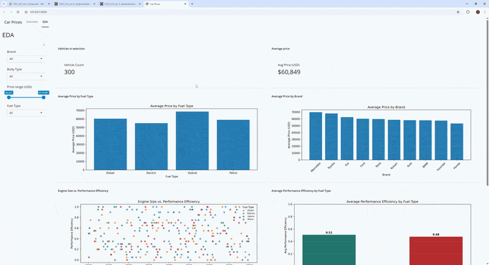

# Hybrid vs Fuel Vehicle Comparison Dashboard

This interactive Shiny dashboard helps environmentally conscious Uber drivers compare hybrid and standard fuel vehicles. It allows users to explore pricing, performance efficiency, engine size, horsepower, and brand trends to better understand the cost benefit tradeoff of greener vehicle technologies.

The dashboard supports informed decision making by enabling dynamic filtering and real time comparison across vehicle attributes.

## Dashboard Links

- **Stable (main):** [Car Price Analysis Dashboard](https://019c91d1-3afa-d970-b785-26d650f700b7.share.connect.posit.cloud/)
- **Preview (dev):** [Development Preview](https://019c91db-1353-42dc-c59a-fb96e3babc9f.share.connect.posit.cloud)

## Demo



## Data Source

Dataset: [Global Cars Enhanced](https://www.kaggle.com/datasets/tatheerabbas/car-price-classification-ready-data) — 300 vehicles with 16 attributes including brand, pricing, engine specs, and efficiency metrics. Source: Kaggle.

## Features

- Sidebar filters for Brand, Body Type, Fuel Type, and Price Range
- Reactive KPI value boxes (Vehicle Count and Average Price)
- Price comparisons by fuel type and brand
- Engine size vs. performance efficiency visualization
- Horsepower vs. price analysis
- Hybrid vs. standard fuel efficiency comparison

## How to set up and run the dashboard (For Contributors)
#### Clone the repo
```bash
git clone https://github.com/UBC-MDS/DSCI-532_2026_1_car_price_analysis.git
cd DSCI-532_2026_1_car_price_analysis
```
#### Set-up the conda environment 
```bash
conda env create -f environment.yml
conda activate car_price_analysis_env
```
#### Run the shiny app 
```bash
shiny run --reload src/app.py
```

## Running Tests

### One-command (all tests — pytest unit + Playwright e2e)
```bash
pytest tests/ -v
```

### Unit tests only (no browser required)
```bash
pytest tests/test_data_processing.py tests/test_charts.py -v
```

### Playwright end-to-end tests only
Requires the Chromium browser to be installed once:
```bash
pip install pytest-playwright
playwright install chromium
```
Then run:
```bash
pytest tests/test_playwright.py -v
```

### What each Playwright test covers

| Test | Behavior verified | What breaks if it changes |
|------|-------------------|--------------------------|
| `test_eda_tab_loads_filter_state` | EDA tab renders the filter state card with Brand = "All" by default | App fails to load or reactive outputs stop rendering |
| `test_vehicle_count_kpi_shows_positive_number` | Vehicle Count KPI displays a positive integer | Data loading or the `compute_kpis` aggregation is broken |
| `test_currency_selector_updates_avg_price_label` | Switching to CAD updates the Avg Price KPI title to "CAD" | Currency reactive input is disconnected from the value box |
| `test_reset_filters_restores_brand_to_all` | Reset Filters button clears a brand selection back to "All" | The reset effect stops firing or stops updating the selectize |
| `test_fuel_filter_change_updates_vehicle_count` | Narrowing fuel type to Electric reduces the vehicle count | The fuel-type filter no longer drives `filtered_df` |

## Contributing

See [CONTRIBUTING.md](CONTRIBUTING.md) for full guidelines.
