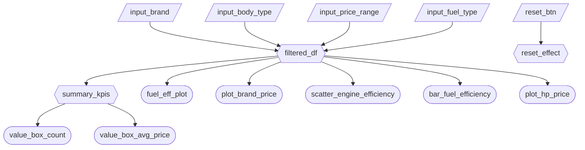

# Milestone 2 – App Specification

## 2.1 Updated Job Stories

| # | Job Story                                                                                                                                                                                                      | Status        | Notes                                                                                                                                    |
| - | -------------------------------------------------------------------------------------------------------------------------------------------------------------------------------------------------------------- | ------------- | ---------------------------------------------------------------------------------------------------------------------------------------- |
| 1 | When I explore brands and vehicle characteristics, I want to filter by brand, body type, fuel type, and price range so I can identify which combinations consistently fall into higher price segments.         | ✅ Implemented | Implemented via sidebar filters, KPI summaries, and average price by brand visualization.                                                |
| 2 | When I compare hybrid vehicles with standard fuel vehicles, I want to see differences in pricing and performance efficiency so I can evaluate the cost premium and efficiency tradeoffs of greener technology. | ✅ Implemented | Implemented via average price by fuel type and grouped efficiency comparison chart.                                                      |
| 3 | When I explore engineering characteristics, I want to study how engine size and horsepower relate to performance efficiency and price so I can detect pricing patterns across fuel types.                      | 🔄 Revised    | Original M1 story referenced vehicle age. Age-based analysis is planned for M3. Current implementation focuses on engineering variables. |

---

## 2.2 Component Inventory

| ID                        | Type            | Shiny widget / renderer            | Depends on                                                       | Job story  |
| ------------------------- | --------------- | ---------------------------------- | ---------------------------------------------------------------- | ---------- |
| input_brand               | Input           | ui.input_selectize                 | —                                                                | #1         |
| input_body_type           | Input           | ui.input_selectize                 | —                                                                | #1         |
| input_price_range         | Input           | ui.input_slider                    | —                                                                | #1         |
| input_fuel_type           | Input           | ui.input_selectize                 | —                                                                | #1, #2, #3 |
| reset_btn                 | Input           | ui.input_action_button             | —                                                                | #1         |
| filtered_df               | Reactive calc   | @reactive.calc                     | input_brand, input_body_type, input_price_range, input_fuel_type | #1, #2, #3 |
| summary_kpis              | Reactive calc   | @reactive.calc                     | filtered_df                                                      | #1         |
| value_box_count           | Output          | @render.ui                         | summary_kpis                                                     | #1         |
| value_box_avg_price       | Output          | @render.ui                         | summary_kpis                                                     | #1         |
| fuel_eff_plot             | Output          | @render.plot                       | filtered_df                                                      | #2         |
| plot_brand_price          | Output          | @render.plot                       | filtered_df                                                      | #1         |
| scatter_engine_efficiency | Output          | @render.plot                       | filtered_df                                                      | #3         |
| bar_fuel_efficiency       | Output          | @render.plot                       | filtered_df                                                      | #2         |
| plot_hp_price             | Output          | @render.plot                       | filtered_df                                                      | #3         |
| reset_effect              | Reactive effect | @reactive.effect + @reactive.event | reset_btn                                                        | #1         |

Reactivity requirements satisfied:

* `filtered_df` depends on four inputs.
* Multiple outputs consume `filtered_df`.
* `summary_kpis` depends on `filtered_df` and feeds two outputs.

---

## 2.3 Reactivity Diagram

---

## 2.4 Calculation Details

### filtered_df

Depends on:

* input_brand
* input_body_type
* input_price_range
* input_fuel_type

Transformation:

* Filters dataset by selected brand unless "All".
* Filters dataset by selected body type unless "All".
* Filters rows within selected price range.
* Filters dataset by selected fuel type unless "All".
* Returns the filtered dataframe.

Consumed by:

* fuel_eff_plot
* plot_brand_price
* scatter_engine_efficiency
* bar_fuel_efficiency
* plot_hp_price
* summary_kpis

---

### summary_kpis

Depends on:

* filtered_df

Transformation:

* Computes number of vehicles in filtered dataset.
* Computes average Price_USD.
* Returns a dictionary containing count and average price.

Consumed by:

* value_box_count
* value_box_avg_price

---

## Complexity Enhancement

### Reset Button

Triggered by:

* reset_btn

Implementation:

* Uses `@reactive.event(input.reset_btn)` and `@reactive.effect`.
* Resets brand, body type, and fuel type inputs to "All".
* Resets price range slider to full dataset range.

Rationale:

* Enables rapid return to baseline view.
* Improves usability during iterative filtering.
* Reduces friction in exploratory analysis.
