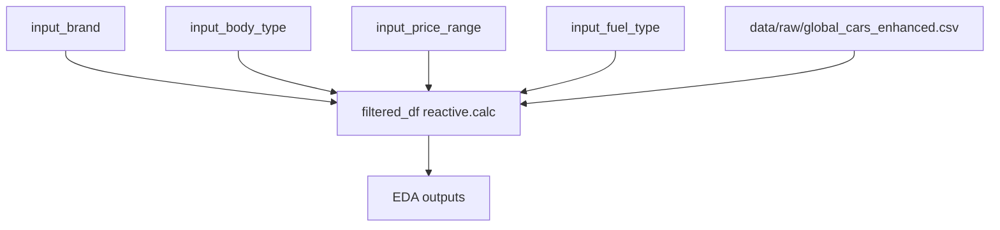

## Updated Job Stories

| User Story                                                                                                                                                                                                                                                                                                                             | Status    | Notes |
| -------------------------------------------------------------------------------------------------------------------------------------------------------------------------------------------------------------------------------------------------------------------------------------------------------------------------------------- | --------- | ----- |
| User Story 1: As a luxury car buyer, I want to explore which brands and vehicle characteristics that consistently fall into the highest price segment in order to choose a premium status vehicle that matches my expectations.                                                                                                        | Unchanged |       |
| User Story 2: As an environmentally conscious Uber driver, I want to compare hybrid vehicles with standard fuel vehicles in terms of pricing and performance efficiency in order to understand the true cost premium of greener technology while ensuring reliability, maximizing passenger capacity, and keeping operating costs low. | Unchanged |       |
| User Story 3: As an automotive market analyst, I want to study how engineering efficiency and vehicle age together influence pricing across segments in order to determine whether buyers pay more for newer, more optimized cars.                                                                                                     | Unchanged |       |

## Component Inventory

- `input_brand`: Selectize input for car brand (`All` + unique values from `Brand`)
- `input_body_type`: Selectize input for body type (`All` + unique values from `Body_Type`)
- `input_price_range`: Slider input for USD price range (min/max from `Price_USD`)
- `input_fuel_type`: Selectize input for fuel type (`All` + unique values from `Fuel_Type`)
- `filtered_df` (`@reactive.calc`): Filtered dataframe with only `Brand`, `Body_Type`, `Price_USD`, and `Fuel_Type`

## Reactivity Diagram

